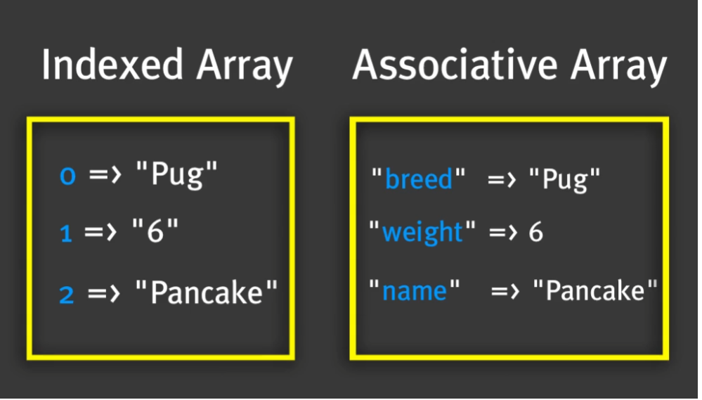
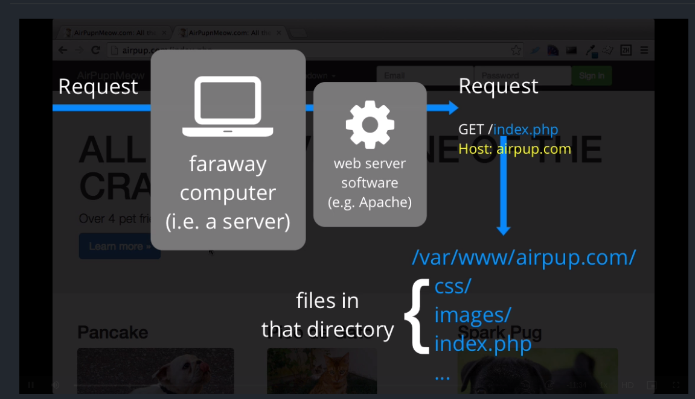
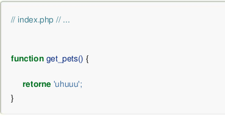
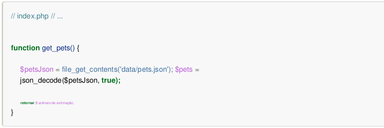

# Capítulo 1

1. Abrir e fechar uma tag em PHP:

```php
<?php código ?>
```

2\. Imprimir uma mensagem:


```php
<?php echo 'Estude PHP na SymfonyCast'; ?>
```



```php
<h1>
    <?php echo 'Estude PHP na SymfonyCast'; ?>
</h1>
```


3\. Criar uma variável:

```php
<?php
    <!-- $nome_da_variavel = valor da variavel; -->
    $var1 = 0;
?>
```

> Para variável numérica, não é necessário inserir nenhum tipo de aspas. Para variáveis do tipo string, já é necessário inserir aspas simples ou duplas.

4\. Imprimir o valor de uma variável:


```php
<?php
    $nome = 'Lauro';
    $idade = 38;
    $msg = 'Estude PHP!';
        echo 'Oi '.$nome."!".' Você tem: '.$idade.' anos. '.$msg;
?>

```



```php
<?php
    $airpupTag = 'I luv puppies';
    $yearFounded = 2015;
?>
<h2>
    <?php echo $airpupTag; ?> (founded <?php echo $yearFounded; ?>)
</h2>
```


## Funções

* Uma função sempre começa com seu nome seguido de abrir e fechar parênteses.
* Normalmente, uma função sempre retorna um valor, podendo ser uma string, um número ou outra coisa.
* A função rand(), gera números aleatórios.

```php
<?php
    $msg = 'Aprenda PHP!';
    $contador = rand();
?>
```

* A função mt\_rand(), também gera números aleatórios.

#### Funções com Argumentos

* Às vezes, podemos controlar o comportamento de uma função, passando um argumento.


```php
<?php
    $msg = 'Aprenda PHP!';
    $contador = rand(50);
?>
```



```php
<?php
    $msg = 'Aprenda PHP!';
    $contador = rand(50, 100);
?>
```


* O PHP geralmente usa a palavra "parâmetro" no lugar de "argumento" em sua documentação.
* Um argumento aparece entre os parênteses da função.
* Funções são máquinas que funcionam e retornam um valor. Argumentos são entradas que nos permitem controlar a função.
* Passamos argumentos para a função como uma lista separada por vírgulas dentro de seus parênteses.
* As funções nem sempre retornam um valor. Algumas funções apenas fazem algo, mas não retornam nada.
* Convertendo uma string para MAIÚSCULAS:


```php
<?php
    $msg = ucwords('Aprenda PHP!');
    $contador = rand(50, 100);
?>
```


* Convertendo uma string para MINÚSCULAS:


```php
<!DOCTYPE html>
<html>
<head>
	<meta charset="utf-8">
	<meta name="viewport" content="width=device-width, initial-scale=1">
	<title>Aprendendo PHP</title>
</head>
<body>
	<h1>
		<?php
			$msg = 'Estude PHP!';
			echo strtolower($msg);
		?>
	</h1>
</body>
</html>
```


* Imprimindo uma string ao contrário:


```php
<!DOCTYPE html>
<html>
<head>
	<meta charset="utf-8">
	<meta name="viewport" content="width=device-width, initial-scale=1">
	<title>Aprendendo PHP</title>
</head>
<body>
	<h1>
		<?php
			$msg = 'Estude PHP!';
			echo strrev(strtolower($msg));
		?>
	</h1>
</body>
</html>
```


* É possível usar uma função dentro da outra, porém, é necessário prestar atenção no fechamento dos parênteses de cada uma das funções.
* Imprimindo uma string toda em MAIÚSCULA:


```php
<!DOCTYPE html>
<html>
<head>
	<meta charset="utf-8">
	<meta name="viewport" content="width=device-width, initial-scale=1">
	<title>Aprendendo PHP</title>
</head>
<body>
	<h1>
		<?php
			$msg = 'Estude PHP!';
			echo strtoupper(strtolower($msg));
		?>
	</h1>
</body>
</html>
```


* As funções normalmente executam alguma instrução e retornam um valor, que você pode atribuir a variáveis ou imprimir usando echo.

## Matrizes e Loops

* Um Array, é um grupo de coisas.
* A sintaxe de declaração de um array é:&#x20;

> #### array() ou $var\[]

* var\_dump() -> É uma função de depuração. É utilizada quando se quer saber algo sobre alguma variável.
* Acessar um item de um array:


```php
<?php
	$pet1 = 'Mastigar Barca';
	$pet2 = 'Faísca Pug'; 
	$pet3 = 'Pico de Gato';

	$pets = array($pet1, $pet2, $pet3);

echo $pets[0];
?>

```



```php
<?php
	$pet1 = 'Mastigar Barca';
	$pet2 = 'Faísca Pug'; 
	$pet3 = 'Pico de Gato';

	$pets = array($pet1, $pet2, $pet3); ?>

<div class="container">
	<div class="row"> 
		<?php 
			foreach ($pets as $pet) { 
				echo '<div class="col-lg-4">'; 
				echo '<h2>'; 
				echo $pet; 
				echo '</h2>';
				echo '<p> teste do foreach...</p>';
				echo '</div>';
			} 
		?>
array() recebe um número ilimitado de argumentos. Então coloque quantas coisas você quiser no seu array!
</div>
<!-- ... -->
</div>
```


* Uma matriz é apenas um container que pode conter qualquer coisa. ada item da matriz recebe uma chave ou índice exclusivo, que podemos usar para fazer referência a esse item posteriormente.

## Arrays Nível 2: Arrays Associativos

* Quando você assume o controle dos índices, ou chaves, de uma matriz, a matriz é conhecida como matriz associativa.
* Quando o array esá cheio de itens onde não especificamos as chaves, dizemos que esse é um tipo de array "indexado".
* Abaixo, estamos especificando as chaves de uma matriz:


```php
<!-- index.php -->
<!-- ... -->

<?php
    $pancake = array(
        'name' => 'Pancake the Bulldog',
        'age'  => '1 year',
        'weight' => 9,
        'bio' => 'Lorem Ipsum',
        'filename' => 'pancake.png'
    );
?>

<!-- index.php -->
<!-- ... -->

<div class="container">
    <div class="row">
        <div class="col-lg-4 pet-list-item">
            <h2><?php echo $pancake['name']; ?></h2>

            " class="img-rounded">

            <blockquote class="pet-details">
                <?php echo $pancake['age']; ?>
                <?php echo $pancake['weight']; ?> lbs
            </blockquote>

            <p>
                <?php echo $pancake['bio']; ?>
            </p>
        </div>

        <!-- the foreach with $pets ... -->
    </div>
</div>
```


* Adicionando itens a um Array, após a sua criação:


```php
<!-- index.php -->
<!-- ... -->

<?php
    // ...

    $pet1 = 'Chew Barka';
    $pet2 = 'Spark Pug';
    $pet3 = 'Pico de Gato';

    $pancake = array(
        'name' => 'Pancake the Bulldog',
        'age'  => '1 year',
        'weight' => 9,
        'bio' => 'Lorem Ipsum',
        'filename' => 'pancake.png'
    );

    $pancake['breed'] = 'Bulldog';

    $pets = array($pet1, $pet2, $pet3);
?>

<!-- index.php -->
<!-- ... -->

<blockquote class="pet-details">
    <span class="label label-info"><?php echo $pancake['breed']; ?></span>
    <?php echo $pancake['age']; ?>
    <?php echo $pancake['weight']; ?> lbs
</blockquote>
```


#### Adicionando itens a um array indexado

```php
<!-- index.php -->
<!-- ... -->

<?php
    $pet1 = 'Chew Barka';
    $pet2 = 'Spark Pug';
    $pet3 = 'Pico de Gato';

    // ... pancake code

    $pets = array($pet1, $pet2, $pet3);

    $pets[] = 'Kitty Gaga';
?>
```

* Para que o PHP escolha o índice automaticamente, deixamos o código exatamente assim:

> $pets\[] = 'Kitty Gaga';
>
> * Quando você não coloca nada entre os colchetes, ele diz ao PHP para escolher a chave para nós, o que ele faz escolhendo o primeiro número disponível (3 neste caso).

## Arrays Nível 3: Colocamos Arrays em seus Arrays

* Tipos de Arrays: Associativos e Indexados.
* Em um Array Associativo, definimos uma chave para um determinado item de um array.
* Em um Array Indexado, o PHP define automaticamente a próxima chave disponível, para o item de um array.

#### Arrays Multidimensionais

* Significa que podemos ter um array dentro de outro array.
* A função "die", encerra a execução do script imediatamente.


_Nunca use a função "die" no seu código real!_




#### Atividade 1 Cap5:&#x20;

1. Access the `bio` on Pancake and print it inside the `<h1>` tag.

```php
<?php
$pets = [
    ['name' => 'Pico de Gato', 'bio' => 'Spicy kitty'],
];
$pets[] = ['name' => 'Waggy Pig', 'bio' => 'Little white dog'];
$pets[] = ['name' => 'Pancake', 'bio' => 'Breakfast is my favorite!'];
?>

<h1>
    <?php echo $pets[2]['bio']; ?>
</h1>
```

#### Atividade 2 Cap5:

1. Using the `$toys` array below, create a `foreach` statement and print each toy's `name` inside an `h3` tag and its `color` inside an `h4` tag.

```php
<?php
$toys = [];
$toys[] = ['name' => 'Bacon Bone', 'color' => 'Bacon-colored'];
$toys[] = ['name' => 'Tennis Ball', 'color' => 'Yellow'];
$toys[] = ['name' => 'Frisbee', 'color' => 'Red'];
?>

<?php 
foreach ($toys as $toto) { ?> 
	<h3><?php echo $toto['name']; ?></h3>
	<h4><?php echo $toto['color']; ?></h4>
<?php } ?>
```

#### Atividade 3 Cap5:


1. Using the `count()` function, print the total number of pet toys that we're selling in the `<h4>` tag.
2. Hint: Be sure the `$toys` variable is defined _before_ trying to count it!

```php
<?php
$toys = [];
$toys[] = ['name' => 'Bacon Bone', 'color' => 'Bacon-colored'];
$toys[] = ['name' => 'Tennis Ball', 'color' => 'Yellow'];
$toys[] = ['name' => 'Frisbee', 'color' => 'Red'];

echo '<h4>';
echo 'Selling ' .count($toys). ' Toys';
echo '</h4>';

?>
```

## Capítulo 6: TRABALHANDO COM ARQUIVOS, JSON E BOOLEANS

* json\_encode() = Recebe um array PHP e retorna a string JSON equivalente.
* json\_decode() = Recebe um arquivo JSON e transforma em um array.
* JSON é um formato de texto que pode ser usado para representar informações estruturadas.
* JSON pode ser lido por PHP ou qualquer outra linguagem, como Ruby, Python ou JavaScript.

### Lendo e abrindo arquivos

* A função _<mark style="background-color:blue;">**file\_get\_contents()**</mark>_, carrega o conteúdo de um arquivo PHP.

#### Atividade 2 Cap6

```php
<?php 
	$toysJson = file_get_contents('toys.json');
	$toys = json_decode($toysJson, true);
?>
<?php foreach ($toys as $toy) { ?>
    <h3><?php echo $toy["name"]; ?></h3>
    <h4><?php echo $toy["color"]; ?></h4>
<?php } ?>
```

#### Atividade 3 Cap6

```php
<?php
	$file = 'doglife.txt';
	$content = 'Dogs rule!';
    	$msg = file_put_contents($file, $content);
	
?>
<h2>
     <?php echo file_get_contents($file); ?>
</h2>

```

## Capítulo 7: As maravilhosas declarações if

* _<mark style="background-color:blue;">**array\_key\_exists()**</mark>_ = Checa se uma chave ou índice existe em um array. Retorna **`true`** se a chave `key` existe no array. `key` pode ser qualquer valor possível para um índice de um array.

#### Atividade 1 Cap7

```php
<?php
$contents = file_get_contents('toys.json');
$toys = json_decode($contents, true);
?>

<?php foreach ($toys as $toy) { ?>
    <h3><?php echo $toy['name']; ?></h3>
	<?php if(array_key_exists('color', $toy)) { ?>
	<h4>
		<?php echo $toy['color']; } else { ?>
		<?php echo "no color"; ?>
		<?php } ?>  
	</h4>		
<?php } ?>
```

#### Atividade 2 Cap7

```php
<?php
$contents = file_get_contents('toys.json');
$toys = json_decode($contents, true);
?>

<?php foreach ($toys as $toy) { ?>
    <h3><?php echo $toy['name']; ?></h3>
    <h4>
        <?php
        if (array_key_exists('color', $toy) 
            && $toy['color']=="multiple") {
            echo "Multiple Colors"; }
            elseif (array_key_exists('color', $toy)==false) {
            echo "no color"; }
            else { echo $toy['color']; }
                
        ?>
    </h4>
<?php } ?>
```

## Capítulo 8: Configuração do Sistema




## Capítulo 9 - Criando Funções

* Quando uma função é requisitada, todo código que estiver entre as chaves "{}" será executado.
* Nem toda função retorna valor.





#### Cap 9 - Ex2

Crie uma nova função get\_great\_pet\_toys() que leia toys.json, decodifique o conteúdo e retorne os brinquedos. Chame isso para obter a matriz de brinquedos.

```php
<?php
function get_great_pet_toys() {
$contents = file_get_contents('toys.json');
$toys = json_decode($contents, true);
return $toys;
}
?>

<?php foreach (get_great_pet_toys() as $code) { ?>
    <h3><?php echo $code['name']; ?></h3>
    <h4><?php echo $code['color']; ?></h4>
<?php } ?>
```

## Capítulo 10: Usando require para incluir funções

#### Função Require

A função **require**() importa arquivos, porém, caso o mesmo não seja encontrado, será levantado uma exceção e a execução é finalizada. Essa é uma maneira de interrompermos a execução dos scripts caso alguma anomalia ocorra.

#### Função Include

A função **include**() do **PHP** tem como objetivo incluir (como o próprio nome diz) um arquivo dentro do outro quando acessado. Caso ocorra algum problema na inclusão deste, será apresentado um Warning (aviso) que não foi possível incluir o arquivo e continuará a exibição da página normalmente sem a inclusão do arquivo.

#### Diferença entre Require e Include

O require vai encerrar a execução do script que está rodando, já o include apenas vai gerar um warning e continuará sua execução.

#### Diferença entre Require\_Once e Include\_Once

A diferença do **include para o include\_once, e require para require\_once**, é que se for include\_once ou require\_once, o arquivo que está sendo incluído será incluído apenas uma vez na execução do código, isso evitará possíveis problemas como variáveis sobrescritas ou que funções e classes sejam redeclaradas causando um erro no código.


#### Atividade 1 Cap10


```php
<?php
require_once('lib/functions.php');
?>

<?php foreach ($toys as $toy) { ?>
    <h3><?php echo $toy['name']; ?></h3>
    <h4><?php echo $toy['color']; ?></h4>
<?php } ?>
```



```php
<?php
function get_great_pet_toys()
{
    $contents = file_get_contents('toys.json');
    $toys = json_decode($contents, true);

    return $toys;
}

$toys = get_great_pet_toys();
?>
```



```json
[
    {
        "name": "Bacon Bone",
        "color": "Bacon Colored"
    },
    {
        "name": "Tennis Ball",
        "color": "Yellow"
    },
    {
        "name": "Frisbee",
        "color": "Multiple Colors"
    }
]
```


## Capítulo 11: Adicionando um layout muito simples

Atividade 1 Cap11


1. Mova todo o HTML do cabeçalho para `header.php`e mova todo o HTML do rodapé para `footer.php`.
2. Em seguida, `require`cada um desses arquivos `index.php`e `aboutUs.php`obter o mesmo layout "legal" em ambas as nossas páginas.


```php
<?php
$airpupTagLine = 'We luv puppies!';
?>
<?php require 'header.php'; ?>
    <h1>Welcome to AirPupNMeow.com!</h1>
    <h3><?php echo $airpupTagLine; ?></h3>
<?php require 'footer.php'; ?>
```



```php
<h1>About Us</h1>

<p>
    We're just a couple of <mark>crazy</mark> cats with a dog-gone good idea!
</p>

<address>
    <strong>AirPupNMeow</strong><br>
    555 Main Street<br>
    San Francisco, CA 94107<br>
    <abbr title="Phone">P:</abbr> (123) 456-7890
</address>


```



```php
<html>
<head>
    <link rel="stylesheet" href="https://maxcdn.bootstrapcdn.com/bootstrap/3.3.5/css/bootstrap.min.css" />
</head>
<body>
<div class="container">

```



```php
<footer>
        &copy; 2015 AirPupNMeow.com
    </footer>
</div>
</body>
</html>
```

