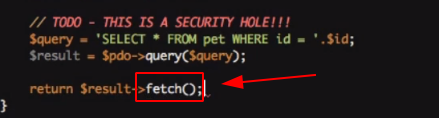

# Aula11

* Cada função é seu próprio universo isolado. Quando você fala sobre quais variáveis você tem acesso e por quê, muitas vezes usamos a palavra “escopo”. _**Se eu disser algo sobre o “escopo da função”, estou falando de todas as variáveis que minha função tem acesso.**_
* Com variáveis, você precisa se preocupar com o escopo e com o que você tem acesso. Mas as funções podem ser chamadas de qualquer lugar.
* O comando _**fetchAll**_: Retorna múltiplas linhas.
* O comando _**fetch**_: Retorna apenas uma única linha.

