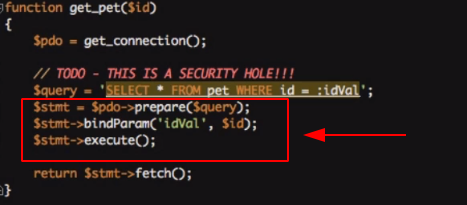

# Aula12


Quando nos deparamos com uma consulta SQL, onde uma parte dela é uma variável, você está vulnerável para um ataque de _**SQL Injection**_.


* Ao alterar a URL, nosso código está enviando 2 consultas para o banco de dados: _**uma para selecionar alguns dados e outra para esvaziar nossa tabela**_.
* As instruções preparadas nos permitem construir uma consulta onde as partes variáveis são mantidas separadas do resto da consulta. Ao fazer isso, o MySQL é capaz de garantir que as partes variáveis não incluam nenhum código SQL desagradável.

#### Como prevenir?

1. Altere a função de consulta para preparar e coloque um _**:idVal**_ onde o valor do _**id**_ deve ir. Isso retorna um objeto _**PDOStatement**_, então vamos renomear a variável também.
2. Chame _**bindParam**_ para dizer ao MySQL que quando você diz _**:idVal**_, você realmente quer dizer o valor da variável _**$id**_. Para realmente executar a consulta:

* A função _**`prepare()`**_ na verdade não executa uma consulta, ela apenas retorna um objeto _**`PDOStatement`**_ que está pronto para ser usado. Para realmente fazer a consulta, chamamos _**`execute()`**_, mas não antes de chamar _**`bindParam()`**_ para cada espaço reservado com o valor real. Para obter os dados da consulta, terminamos chamando _**`fetch()`**_ ou _**`fetchAll()`**_.

