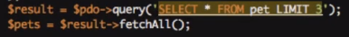
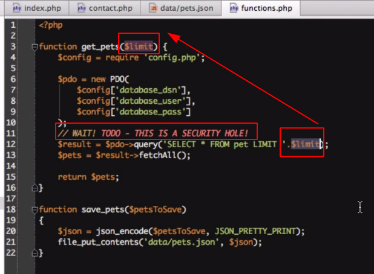

# Aula8

* O comando TRUNCATE TABLE remove todas as linhas de uma tabela sem registrar as exclusões de linhas individuais – ou seja, remove o conteúdo de uma tabela em uma única instrução.
* O TRUNCATE TABLE funciona como a instrução DELETE, porém sem usar a cláusula WHERE.
* Entretanto, essa instrução é mais rápida e utiliza menos recursos de sistema e log de transações.

#### Limitando o número de resultados da consulta

* Para deixar o código de consulta mais dinâmico, é possível criar uma variável `$limit`, atribuir um valor e inseri-la como argumento dentro da função `get_pets($limit)`, que possui um argumento obrigatório. Funciona! Porém há um ENORME problema e BUG de segurança!!!


#### Falha de Segurança!!!&#x20;



Sempre que você cria uma consulta de banco de dados, que tenha alguma variável, você se abre para um ataque de SQL Injection. Este é provavelmente o ataque mais comum na web e um erro dará ao invasor acesso total para fazer qualquer coisa em seu banco de dados.

