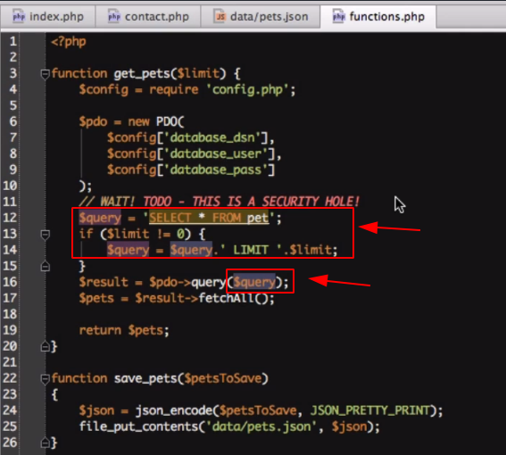

# Aula9

#### Como resolver o problema de falha de segurança (SQL Injection)

1. Inicialmente, passaremos o valor `0` como argumento para a função `get_pets().` Ficando assim o código: `get_pets(0).`&#x20;
2. Adicione uma instrução `if` em `get_pets()`. Vamos adicionar o limite apenas se a variável `$limit` estiver definida como algo diferente de zero. Podemos fazer isso primeiro criando uma variável `$query`.

A instrução `if` espera como retorno, um booleano (`true/false`). Como a variável `$limit` não é um booleano, não está vazia e nem tem o valor `0`, o próprio PHP avalia e aceita ou não a condição passada conforme a tabela abaixo:

* Podemos tornar o argumento `$limit` completamente opcional, apenas atribuindo um valor a ele quando você declarar o argumento em `get_pets()`, da seguinte maneira:


_**Null**_ é um valor igual a nada!



Tanto _**`0`**_ quanto _**`null`**_ parecerão falsos na instrução _**`if`**_, portanto, o código agirá da mesma forma. Como _**`null`**_ não significa nada, parece um pouco pouco melhor usá-lo como o valor padrão para um argumento opcional.



O nome e os argumentos de uma função são chamados de _**“assinatura”**_, pois isso é apenas uma maneira de se referir aos argumentos que a função possui e também ao valor que ela retorna.

